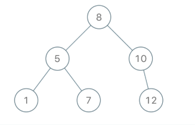

# Leetcode 1008 先序遍历构造二叉树
***
### 题目描述

返回与给定先序遍历 `preorder` 相匹配的二叉搜索树（binary **search** tree）的根结点。

(回想一下，二叉搜索树是二叉树的一种，其每个节点都满足以下规则，对于 `node.left` 的任何后代，值总 `< node.val`，而 `node.right` 的任何后代，值总 `> node.val`。此外，先序遍历首先显示节点的值，然后遍历 `node.left`，接着遍历 `node.right`。）


**示例:**

	输入：[8,5,1,7,10,12]
	输出：[8,5,10,1,7,null,12]



**提示：**

1. `1 <= preorder.length <= 100`
2. 先序 `preorder` 中的值是不同的。

### 考点

树


### 代码(递归)
执行用时: **52ms**, 内存消耗: **13.7MB**

```
# Definition for a binary tree node.
# class TreeNode:
#     def __init__(self, x):
#         self.val = x
#         self.left = None
#         self.right = None

class Solution:
    def bstFromPreorder(self, preorder: List[int]) -> TreeNode:
        if not preorder:
            return None
        root = TreeNode(preorder[0])
        leftVals, rightVals = [], []
        for val in preorder[1:]:
            if val < root.val:
                leftVals.append(val)
            else:
                rightVals.append(val)
        root.left = self.bstFromPreorder(leftVals)
        root.right = self.bstFromPreorder(rightVals)
        return root
```

### 代码2(迭代)

```
# Definition for a binary tree node.
# class TreeNode:
#     def __init__(self, x):
#         self.val = x
#         self.left = None
#         self.right = None

class Solution:
    def bstFromPreorder(self, preorder: List[int]) -> TreeNode:
        stack = []
        root = TreeNode(preorder[0])
        stack.append(root)
        for i in range(1,len(preorder)):
            node, child = stack[-1], TreeNode(preorder[i])
            while stack and stack[-1].val < child.val:
                node = stack.pop()           
            if child.val < node.val:
                node.left = child
            else:
                node.right = child
            stack.append(child)                           
        return root
```
