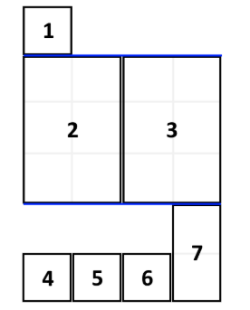

# Leetcode 1105 填充书架
***
### 题目描述

附近的家居城促销，你买回了一直心仪的可调节书架，打算把自己的书都整理到新的书架上。

你把要摆放的书 `books` 都整理好，叠成一摞：从上往下，第 i 本书的厚度为 `books[i][0]`，高度为 `books[i][1]`。

按顺序 将这些书摆放到总宽度为 `shelf_width` 的书架上。

先选几本书放在书架上（它们的厚度之和小于等于书架的宽度 `shelf_width`），然后再建一层书架。重复这个过程，直到把所有的书都放在书架上。

需要注意的是，在上述过程的每个步骤中，**摆放书的顺序与你整理好的顺序相同**。 例如，如果这里有 5 本书，那么可能的一种摆放情况是：第一和第二本书放在第一层书架上，第三本书放在第二层书架上，第四和第五本书放在最后一层书架上。

每一层所摆放的书的最大高度就是这一层书架的层高，书架整体的高度为各层高之和。

以这种方式布置书架，返回书架整体可能的最小高度。



**示例:**

    输入：books = [[1,1],[2,3],[2,3],[1,1],[1,1],[1,1],[1,2]], shelf_width = 4
	输出：6
	解释：
	3 层书架的高度和为 1 + 3 + 2 = 6 。
	第 2 本书不必放在第一层书架上。
	
**说明：**

1. `1 <= books.length <= 1000`
2. `1 <= books[i][0] <= shelf_width <= 1000`
3. `1 <= books[i][1] <= 1000`


### 考点

动态规划


### 代码
执行用时: **68ms**, 内存消耗: **13.9MB**

```
class Solution:
    def minHeightShelves(self, books: List[List[int]], shelf_width: int) -> int:
        L = len(books)
        dp = [1000000] * (L + 1)
        dp[0] = 0
        for i in range(1, L + 1):
            cur_width, j, cur_depth = 0, i, 0
            while j > 0:
                cur_width += books[j-1][0]
                if cur_width > shelf_width:
                    break
                cur_depth = max(cur_depth, books[j-1][1])
                dp[i] = min(dp[i], dp[j-1] + cur_depth)
                j -= 1
        return dp[-1]
```

