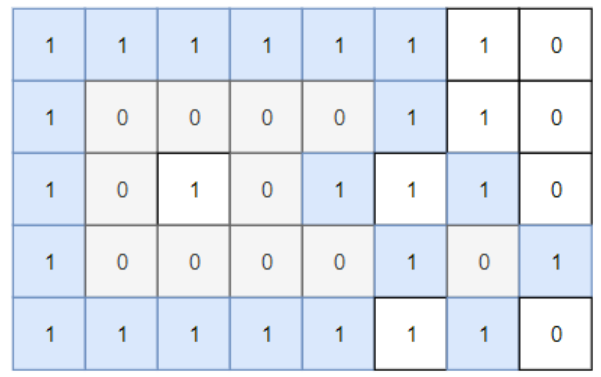
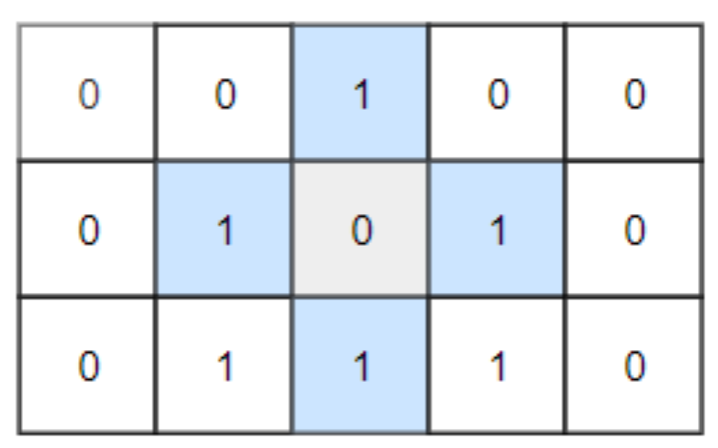

# Leetcode 1254 统计封闭岛屿的数目
***
### 题目描述

有一个二维矩阵 `grid` ，每个位置要么是陆地（记号为 `0` ）要么是水域（记号为 `1` ）。

我们从一块陆地出发，每次可以往上下左右 4 个方向相邻区域走，能走到的所有陆地区域，我们将其称为一座「**岛屿**」。

如果一座岛屿 完全 由水域包围，即陆地边缘上下左右所有相邻区域都是水域，那么我们将其称为 「**封闭岛屿**」。

请返回封闭岛屿的数目。


**示例1:**



	输入：grid = [[1,1,1,1,1,1,1,0],[1,0,0,0,0,1,1,0],[1,0,1,0,1,1,1,0],[1,0,0,0,0,1,0,1],[1,1,1,1,1,1,1,0]]
	输出：2
	解释：
	灰色区域的岛屿是封闭岛屿，因为这座岛屿完全被水域包围（即被 1 区域包围）。


**示例2：**



	输入：grid = [[0,0,1,0,0],[0,1,0,1,0],[0,1,1,1,0]]
	输出：1
	
**示例3:**
	
	输入：grid = [[1,1,1,1,1,1,1], 
		     [1,0,0,0,0,0,1],
		     [1,0,1,1,1,0,1],
		     [1,0,1,0,1,0,1],
		     [1,0,1,1,1,0,1],
		     [1,0,0,0,0,0,1],
                     [1,1,1,1,1,1,1]]
	输出：2


**提示：**

* `1 <= grid.length, grid[0].length <= 100`
* `0 <= grid[i][j] <=1`

### 考点

DFS


### 思路
染色法，每座封闭岛屿只保留一个 `0`, 其他都染色为 `1`.


### 代码
执行用时: **136ms**, 内存消耗: **13.5MB**

```
class Solution:
    def closedIsland(self, grid: List[List[int]]) -> int:
        
        def fun(i, j):
            if grid[i][j] == 0:
                grid[i][j] = 1
                if i + 1 < len(grid): fun(i + 1, j)
                if i - 1 >= 0: fun(i - 1, j)
                if j + 1 < len(grid[0]): fun(i, j + 1)
                if j - 1 >= 0: fun(i, j - 1)
        
        for i in range(len(grid)):
            fun(i, 0)
            fun(i, len(grid[0]) - 1)
        for j in range(len(grid[0])):
            fun(0, j)
            fun(len(grid) - 1, j)
        
        res = 0
        for i in range(len(grid)):
            for j in range(len(grid[0])):
                if grid[i][j] == 0:
                    fun(i, j)
                    res += 1
                
        return res
```


