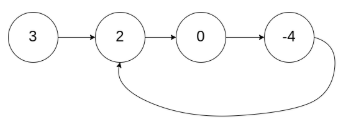
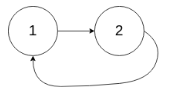
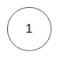

# Leetcode 142 环形链表II
***
### 题目描述

给定一个链表，返回链表开始入环的第一个节点。 如果链表无环，则返回 `null`。

为了表示给定链表中的环，我们使用整数 `pos` 来表示链表尾连接到链表中的位置（索引从 0 开始）。 如果 `pos` 是 `-1`，则在该链表中没有环。

**说明：** 不允许修改给定的链表。

**示例1：**

	输入：head = [3,2,0,-4], pos = 1
	输出：tail connects to node index 1
	解释：链表中有一个环，其尾部连接到第二个节点。




**示例2：**

	输入：head = [1,2], pos = 0
	输出：tail connects to node index 0
	解释：链表中有一个环，其尾部连接到第一个节点。



**示例3：**

	输入：head = [1], pos = -1
	输出：no cycle
	解释：链表中没有环。



**进阶：** 你是否可以不用额外空间解决此题？

### 考点

链表


### 思路
分两个步骤，首先通过快慢指针的方法判断链表是否有环；接下来如果有环，则寻找入环的第一个节点。具体的方法为，首先假定链表起点到入环的第一个节点A的长度为a【未知】，到快慢指针相遇的节点B的长度为（a + b）【这个长度是已知的】。现在我们想知道a的值，注意到快指针p2始终是慢指针p走过长度的2倍，所以慢指针p从B继续走（a + b）又能回到B点，如果只走a个长度就能回到节点A。但是a的值是不知道的，解决思路是曲线救国，注意到起点到A的长度是a，那么可以用一个从起点开始的新指针q和从节点B开始的慢指针p同步走，相遇的地方必然是入环的第一个节点A。 


### 代码
执行用时: **48ms**, 内存消耗: **18.4MB**。

```
# Definition for singly-linked list.
# class ListNode(object):
#     def __init__(self, x):
#         self.val = x
#         self.next = None

class Solution(object):
    def detectCycle(self, head):
        """
        :type head: ListNode
        :rtype: ListNode
        """
        if head == None:
            return None
        p, q = head, head
        flagCycle = 0
        while q.next != None and q.next.next != None:
            p = p.next
            q = q.next.next
            if p == q:
                flagCycle = 1
                break
        if flagCycle:
            res = head
            while p != res:
                p = p.next
                res = res.next
            return res
        else:
            return None
```

### 代码2(集合做法，执行用时：36ms)
```
# Definition for singly-linked list.
# class ListNode(object):
#     def __init__(self, x):
#         self.val = x
#         self.next = None

class Solution(object):
    def detectCycle(self, head):
        """
        :type head: ListNode
        :rtype: ListNode
        """
        s = {None}
        while head not in s:
            s.add(head)
            head = head.next
        return head
```


