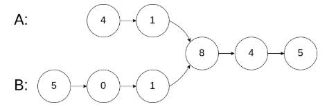
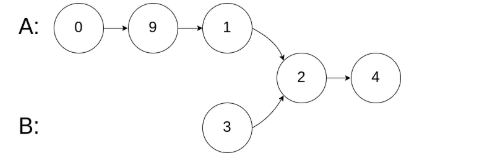
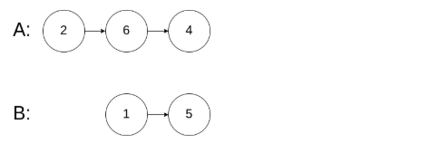

# Leetcode 160 相交链表
***
### 题目描述
编写一个程序，找到两个单链表相交的起始节点。

如下面的两个链表：


在节点 c1 开始相交。

**示例1:**  



	输入：intersectVal = 8, listA = [4,1,8,4,5], listB = [5,0,1,8,4,5], skipA = 2, skipB = 3
	输出：Reference of the node with value = 8
	输入解释：相交节点的值为 8 （注意，如果两个列表相交则不能为 0）。从各自的表头开始算起，链表 A 为 	[4,1,8,4,5]，链表 B 为 [5,0,1,8,4,5]。在 A 中，相交节点前有 2 个节点；在 B 中，相交节点前有 3 个节点。


**示例2:**



	输入：intersectVal = 2, listA = [0,9,1,2,4], listB = [3,2,4], skipA = 3, skipB = 1
	输出：Reference of the node with value = 2
	输入解释：相交节点的值为 2 （注意，如果两个列表相交则不能为 0）。从各自的表头开始算起，链表 A 为 	[0,9,1,2,4]，链表 B 为 [3,2,4]。在 A 中，相交节点前有 3 个节点；在 B 中，相交节点前有 1 个节点。


**示例3:**



	输入：intersectVal = 0, listA = [2,6,4], listB = [1,5], skipA = 3, skipB = 2
	输出：null
	输入解释：从各自的表头开始算起，链表 A 为 [2,6,4]，链表 B 为 [1,5]。由于这两个链表不相交，所以 	intersectVal 必须为 0，而 skipA 和 skipB 可以是任意值。
	解释：这两个链表不相交，因此返回 null。


**注意：**

* 如果两个链表没有交点，返回 `null`.
* 在返回结果后，两个链表仍须保持原有的结构。
* 可假定整个链表结构中没有循环。
* 程序尽量满足 O(n) 时间复杂度，且仅用 O(1) 内存。


### 考点

链表


### 代码
执行用时: **224ms**, 内存消耗: **41.7MB**

```
# Definition for singly-linked list.
# class ListNode(object):
#     def __init__(self, x):
#         self.val = x
#         self.next = None

class Solution(object):
    def getIntersectionNode(self, headA, headB):
        """
        :type head1, head1: ListNode
        :rtype: ListNode
        """
        if not headA or not headB:
            return None
        /**
        定义两个指针, 第一轮让两个到达末尾的节点指向另一个链表的头部, 最后如果相遇则为交点(在第一轮移动中恰好抹除了长度差)
        两个指针等于移动了相同的距离, 有交点就返回, 无交点就是各走了两条指针的长度
        **/
        p, q = headA, headB
        // 在这里第一轮体现在pA和pB第一次到达尾部会移向另一链表的表头, 而第二轮体现在如果pA或pB相交就返回交点, 不相交最后就是null==null
        while p != q:
            if not p:
                p = headB
            else:
                p = p.next
            if not q:
                q = headA
            else:
                q = q.next
        return p
```

