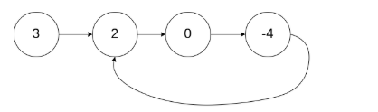
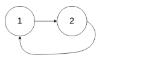

# Leetcode 141 环形链表
***
### 题目描述

给定一个链表，判断链表中是否有环。

为了表示给定链表中的环，我们使用整数 pos 来表示链表尾连接到链表中的位置（索引从 0 开始）。 如果 pos 是 -1，则在该链表中没有环。


**示例1:**  

	输入：head = [3,2,0,-4], pos = 1
	输出：true
	解释：链表中有一个环，其尾部连接到第二个节点。
	


**示例2:** 

	输入：head = [1,2], pos = 0
	输出：true
	解释：链表中有一个环，其尾部连接到第一个节点。
	


**示例3:** 

	输入：head = [1], pos = -1
	输出：false
	解释：链表中没有环。
	


**进阶:**  你能用 *O(1)*（即，常量）内存解决此问题吗？


### 考点

链表

### 思路

用两个指针`fast`, `slow`. 其中`fast`每次走两步，`slow`每次走一步，当`fast` 和 `slow`再次遇到，则说明链表有环。


### 代码
执行用时: **44ms**, 内存消耗: **18.1MB**

```
# Definition for singly-linked list.
# class ListNode(object):
#     def __init__(self, x):
#         self.val = x
#         self.next = None

class Solution(object):
    def hasCycle(self, head):
        """
        :type head: ListNode
        :rtype: bool
        """
        fast, slow = head, head
        while fast and fast.next and fast.next.next:
            fast = fast.next.next
            slow = slow.next
            if fast == slow:
                return True
        return False
```
