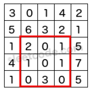

# Leetcode 304 二维区域和检索-矩阵不可变
***
### 题目描述

给定一个二维矩阵，计算其子矩形范围内元素的总和，该子矩阵的左上角为 *(row1, col1)* ，右下角为 *(row2, col2)*。   



上图子矩阵左上角(row1, col1) = **(2, 1)**, 右下角(row2, col2) = **(4, 3)**，该子矩阵内元素的总和为8.

**示例：**

	给定 matrix = [
      [3, 0, 1, 4, 2],
      [5, 6, 3, 2, 1],
      [1, 2, 0, 1, 5],
      [4, 1, 0, 1, 7],
      [1, 0, 3, 0, 5]
    ]

    sumRegion(2, 1, 4, 3) -> 8
    sumRegion(1, 1, 2, 2) -> 11
    sumRegion(1, 2, 2, 4) -> 12

**注意：**

1. 你可以假设矩阵不可变。
2. 会多次调用 *sumRegion* 方法。
3. 你可以假设 *row1 ≤ row2* 且 *col1 ≤ col2*。

### 考点

动态规划

### 思路
注意题目中说的会多次调用 sumRegion 方法，而且矩阵 matrix 不变，所以如果直接在 sumRegion 中计算的话，可以通过，但是时间复杂度非常高。所以考虑过后采用动态规划方法，提前算出来每个位置的左上角区域元素和，即动态规划方程为：  
`self.dp[i][j] = matrix[i-1][j-1] + self.dp[i-1][j] + self.dp[i][j-1] - self.dp[i-1][j-1]`

### 代码
执行用时: **80ms**, 内存消耗: **15.8MB**。

```
class NumMatrix:

    def __init__(self, matrix: List[List[int]]):
        self.m = len(matrix) 
        self.n = 0 if self.m == 0 else len(matrix[0])
        self.dp = [[0] * (self.n+1) for _ in range(self.m+1)]
        for i in range(1, self.m+1):
            for j in range(1, self.n+1):
                self.dp[i][j] = matrix[i-1][j-1] + self.dp[i-1][j] + self.dp[i][j-1] - self.dp[i-1][j-1]

    def sumRegion(self, row1: int, col1: int, row2: int, col2: int) -> int:
        res = self.dp[row2+1][col2+1] - self.dp[row1][col2+1] - self.dp[row2+1][col1] + self.dp[row1][col1]
        return res
        


# Your NumMatrix object will be instantiated and called as such:
# obj = NumMatrix(matrix)
# param_1 = obj.sumRegion(row1,col1,row2,col2)
```


