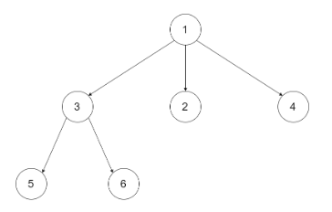

# Leetcode 429 N叉树的层序遍历
***
### 题目描述
给定一个 N 叉树，返回其节点值的层序遍历。 (即从左到右，逐层遍历)。

例如，给定一个 `3叉树` :



返回其层序遍历：

	[
     [1],
     [3,2,4],
     [5,6]
	]


**说明：**

1. 树的深度不会超过 `1000`。
2. 树的节点总数不会超过 `5000`。


### 考点

树


### 代码
执行用时: **120ms**, 内存消耗: **17.3MB**

```
"""
# Definition for a Node.
class Node:
    def __init__(self, val, children):
        self.val = val
        self.children = children
"""
class Solution:
    def levelOrder(self, root: 'Node') -> List[List[int]]:
        if not root:
            return []
        res, cur = [], [root]
        while cur:
            v = []
            nex = []
            for node in cur:
                v.append(node.val)
                nex += node.children
            res.append(v)
            cur = nex
        return res
```

