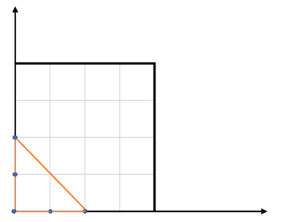

# Leetcode 812 最大三角形面积
***
### 题目描述
给定包含多个点的集合，从其中取三个点组成三角形，返回能组成的最大三角形的面积。

**示例1：**

	输入: points = [[0,0],[0,1],[1,0],[0,2],[2,0]]
	输出: 2
	解释: 
	这五个点如下图所示。组成的橙色三角形是最大的，面积为2。



	
**注意：**

1. `3 <= points.length <= 50`.
2. 不存在重复的点。
3.  `-50 <= points[i][j] <= 50`.
4. 结果误差值在 `10^-6` 以内都认为是正确答案。

### 考点

数学

### 代码
执行用时: **252ms**, 内存消耗: **13.1MB**

```
class Solution:
    def largestTriangleArea(self, points: List[List[int]]) -> float:
        from itertools import combinations
        res = 0
        for each in combinations(points, 3):
            x = [each[0][0], each[1][0], each[2][0]]
            y = [each[0][1], each[1][1], each[2][1]]
            area = abs((x[0] - x[2]) * (y[1] - y[2]) - (x[1] - x[2]) * (y[0] - y[2])) / 2
            res = max(res, area)
        return res
```
