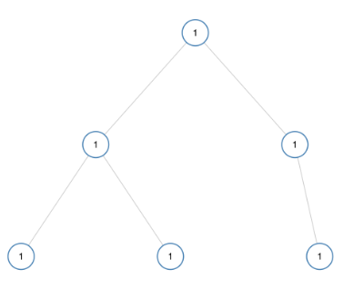
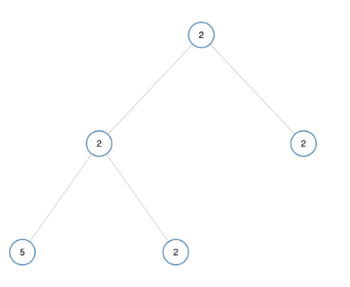

# Leetcode 965 单值二叉树
***
### 题目描述

如果二叉树每个节点都具有相同的值，那么该二叉树就是单值二叉树。

只有给定的树是单值二叉树时，才返回 `true`；否则返回 `false`。


**示例1:**



	输入：[1,1,1,1,1,null,1]
	输出：true
	
**示例2:**



	输入：[2,2,2,5,2]
	输出：false


**提示：**

1. 给定树的节点数范围是 `[1, 100]`。
2. 每个节点的值都是整数，范围为 `[0, 99]` 。


### 考点

树


### 代码
执行用时: **168ms**, 内存消耗: **14.3MB**

```
# Definition for a binary tree node.
# class TreeNode:
#     def __init__(self, x):
#         self.val = x
#         self.left = None
#         self.right = None

class Solution:
    def isUnivalTree(self, root: TreeNode) -> bool:
        if not root:
            return True
        if root.left and root.left.val != root.val:
            return False
        if root.right and root.right.val != root.val:
            return False
        return self.isUnivalTree(root.left) and self.isUnivalTree(root.right)
```
