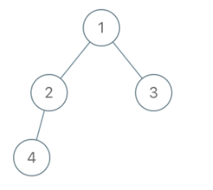
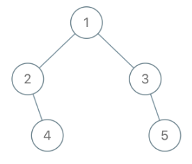
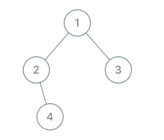

# Leetcode 993 二叉树的堂兄弟节点
***
### 题目描述
在二叉树中，根节点位于深度 `0` 处，每个深度为 `k` 的节点的子节点位于深度 `k+1` 处。

如果二叉树的两个节点深度相同，但父节点不同，则它们是一对堂兄弟节点。

我们给出了具有唯一值的二叉树的根节点 `root`，以及树中两个不同节点的值 `x` 和 `y`。

只有与值 `x` 和 `y` 对应的节点是堂兄弟节点时，才返回 `true`。否则，返回 `false`。


**示例1:**     



	输入：root = [1,2,3,4], x = 4, y = 3
	输出：false
	
**示例2:**     



	输入：root = [1,2,3,null,4,null,5], x = 5, y = 4
	输出：true
	

**示例3:**     



	输入：root = [1,2,3,null,4], x = 2, y = 3
	输出：false

**说明：**

1. 二叉树的节点数介于 `2` 到 `100` 之间。
2. 每个节点的值都是唯一的、范围为 `1` 到 `100` 的整数。


### 考点

树


### 代码
执行用时: **48ms**, 内存消耗: **13.2MB**

```
"""
# Definition for a binary tree node.
# class TreeNode:
#     def __init__(self, x):
#         self.val = x
#         self.left = None
#         self.right = None

class Solution:
    def isCousins(self, root: TreeNode, x: int, y: int) -> bool:
        if not root:
            return False
        cur = [root]
        while cur:
            nex = []
            val = []
            for node in cur:
                val1, val2 = -1, -1
                if node.left:
                    val1 = node.left.val
                    nex.append(node.left)
                if node.right:
                    val2 = node.right.val
                    nex.append(node.right)
                if (val1 == x and val2 == y) or (val1 == y and val2 == x):
                    return False
                val.append(val1); val.append(val2)
            if x in val and y in val:
                return True
            cur = nex
        return False
```

