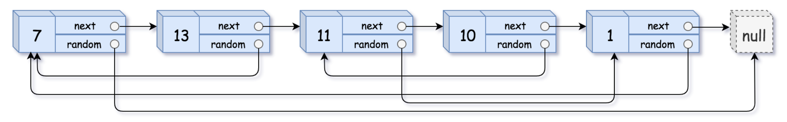
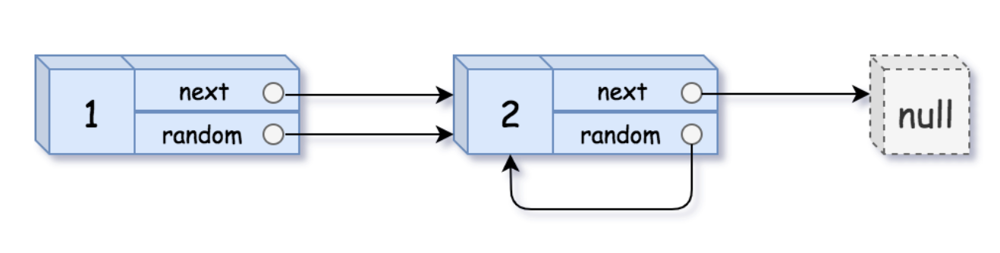
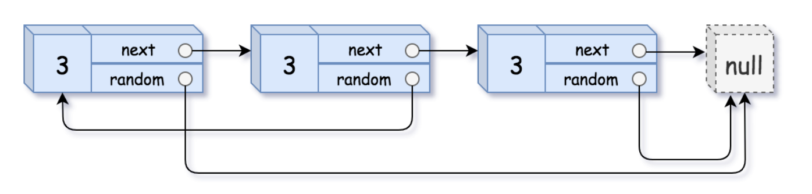

# Leetcode 面试题 35 复杂链表的复制
***
### 题目描述

请实现 `copyRandomList` 函数，复制一个复杂链表。在复杂链表中，每个节点除了有一个 `next` 指针指向下一个节点，还有一个 `random` 指针指向链表中的任意节点或者 `null`。


**示例1：**



	输入：head = [[7,null],[13,0],[11,4],[10,2],[1,0]]
	输出：[[7,null],[13,0],[11,4],[10,2],[1,0]]

**示例2：**



	输入：head = [[1,1],[2,1]]
	输出：[[1,1],[2,1]]
	
**示例3：**



	输入：head = [[3,null],[3,0],[3,null]]
	输出：[[3,null],[3,0],[3,null]]

**示例4：**

	输入：head = []
	输出：[]
	解释：给定的链表为空（空指针），因此返回 null。


**说明：**

* `-10000 <= Node.val <= 10000`
* `Node.random 为空（null）或指向链表中的节点。`
* `节点数目不超过 1000 。`


**考点**

链表


### 思路

1. 优化的迭代

我们也可以不使用哈希表的额外空间来保存已经拷贝过的结点，而是将链表进行拓展，在每个链表结点的旁边拷贝，比如 `A->B->C` 变成 `A->A'->B->B'->C->C'`，然后将拷贝的结点分离出来变成 `A->B->C`和`A'->B'->C'`，最后返回 `A'->B'->C'`。

2. 图DFS

从头结点 head 开始拷贝；
由于一个结点可能被多个指针指到，因此如果该结点已被拷贝，则不需要重复拷贝；
如果还没拷贝该结点，则创建一个新的结点进行拷贝，并将拷贝过的结点保存在哈希表中；
使用递归拷贝所有的 next 结点，再递归拷贝所有的 random 结点。


### 代码1（优化的迭代）
执行用时: **64ms**, 内存消耗: **14.1MB**

```
"""
# Definition for a Node.
class Node:
    def __init__(self, x: int, next: 'Node' = None, random: 'Node' = None):
        self.val = int(x)
        self.next = next
        self.random = random
"""
class Solution:
    def copyRandomList(self, head: 'Node') -> 'Node':
        if not head: return head
        cur = head
        while cur:
            new_node = Node(cur.val, None, None)
            new_node.next = cur.next
            cur.next = new_node
            cur = new_node.next
        cur = head
        while cur:
            cur.next.random = cur.random.next if cur.random else None
            cur = cur.next.next
        old = head
        new = head.next
        copy = head.next
        while old:
            old.nex
```

### 代码2（图DFS）

```
class Solution:
    def copyRandomList(self, head: 'Node') -> 'Node':
        def dfs(head):
            if not head: return None
            if head in visited:
                return visited[head]
            # 创建新结点
            copy = Node(head.val, None, None)
            visited[head] = copy
            copy.next = dfs(head.next)
            copy.random = dfs(head.random)
            return copy
        visited = {}
        return dfs(head)
```


